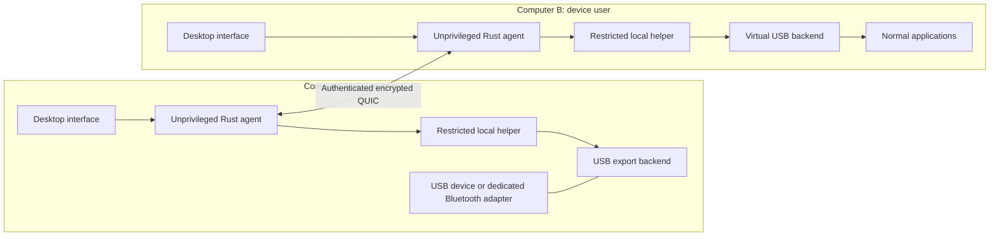

# ADR 0001: Reuse device backends and own the connection experience

Date: 2026-09-08

Status: original design. The implemented Linux alpha and the local-browser UI
adjustment are recorded in [ADR 0002](adr-0002-linux-alpha.md). Physical hardware
validation remains pending. The implemented Windows 11 x64 backend is recorded
in [ADR 0003](adr-0003-windows-alpha.md); the limited macOS export preview is recorded in [ADR 0004](adr-0004-macos-export.md). Mac import remains future work.

Account-based setup now supersedes the invitation-first product model below; see
[ADR 0006](adr-0006-accounts.md). Keyboard/mouse control is in [ADR 0005](adr-0005-input-control.md).

The [research](research.md) supplies the upstream evidence. The design below is
PortRelay's engineering decision, not a claim that these components already work
together.

## Product model

The same application has two views: **This computer** and **Other computers**.
Sharing is opt-in per device and trusted peer. LAN discovery lists computers,
not private device inventories. Internet pairing uses an invitation containing
the intended peer identity and rendezvous information.

The owner approves a peer before revealing shared devices. A successful pairing
does not grant access to every device. Once authorized, the receiving computer
can connect with one action. The UI explains when the device will stop working
locally, who owns it, and how the owner can take it back.

No cloud account is required. LAN-only mode must disable public discovery and
relays and still work on an isolated network. When multicast is unavailable,
manual address or invitation entry remains available.

## Components



- **Desktop:** Tauri 2 with a small TypeScript interface. It displays agent state
  and issues bounded commands. It has no direct privileged device access.
- **Agent and CLI:** Rust/Tokio for discovery, pairing, permissions, sessions,
  transport, and diagnostics. Headless operation does not depend on a WebView.
- **Helper:** A separate, narrowly scoped privileged service. Authenticate the
  calling local user through OS IPC permissions and peer credentials. Accept
  typed operations and validated device identifiers, never shell fragments.
- **Backends:** Linux USB/IP first; Windows usbipd-win export and usbip-win2
  import next. Limited macOS export is a separate development preview; macOS import has
  an entitlement gate. Probe installed versions and actual capabilities at runtime.
- **Transport:** iroh for authenticated QUIC, direct routes, and relay fallback.
  Use a versioned control protocol and one reliable ordered stream per device
  session. Device data is not a lossy datagram protocol.
- **Optional relay:** Self-hostable upstream relay with an open deployment
  recipe. No device authorization, plaintext device content, or account database
  belongs in the relay. Routing metadata can still be visible to infrastructure.

Separate backend interfaces cover inventory, capabilities, export, import,
release, and recovery. Unsupported operations return a specific reason. A desktop
build for an OS must not imply that its USB or Bluetooth backend is usable.

## Bridging existing USB/IP

Keep USB/IP's request format and existing OS drivers. The first technical spike
must show how a local USB/IP socket is carried inside the encrypted device
stream. Where an upstream client only accepts TCP, a temporary local bridge
terminates the encrypted transport and exposes only that authorized session.

The bridge must check the requested device against the lease, reject arbitrary
host/port destinations and unapproved USB/IP imports, and close on revocation.
It must preserve ordering, flow control, half-close behavior, and cancellation.
Do not multiplex device payloads through a JSON control API or an unbounded queue.

Some upstream daemons listen broadly or create permissive firewall rules. A
successful encrypted tunnel does not secure that separate listener. The backend
must restrict raw USB/IP access using OS-supported isolation or firewall policy
before sharing is enabled. Loopback binding alone also does not establish
authorization against other local users; the helper and bridge design must
account for that. If isolation cannot be established, fail closed.

## Security boundaries

- Generate and persist a unique endpoint identity per installation. Use the OS
  credential store or an appropriately protected key file.
- Bootstrap trust with a cryptographically random, expiring, single-use
  invitation bound to the advertised endpoint identity. A public endpoint ID
  alone is not an authorization secret. Require approval on the owner computer
  and show a peer identity comparison when pairing.
- Let the reviewed transport library supply cryptography. Do not invent a short
  numeric-code handshake; any later short-code UX needs a reviewed pairing
  protocol with online-guessing protection.
- Rate-limit pairing attempts, bound incoming frame sizes and concurrent work,
  version the protocol, and reject unknown or malformed commands.
- Authenticate a peer before giving it device inventory. Check device permission
  again when acquiring a lease and opening a data stream. Disable replayable
  early-data behavior for state-changing requests.
- Revocation must terminate live device streams and prevent new sessions.
- Treat a remote USB device as potentially hostile input to the receiving OS.
  Encryption authenticates the computer; it does not make its hardware trusted.
- Keep boot devices, mounted storage, and active input/network devices out of
  automatic sharing. Dedicated Bluetooth adapters are the supported first path.
- Record diagnostic state transitions without payloads, private keys, pairing
  secrets, or unredacted device serials. Telemetry is off by default.

## Device ownership and recovery

The exporting agent is authoritative for a device lease. At most one consumer
owns an exported device. Use session IDs and a generation counter so late
messages cannot act on a new device instance that reused the same bus address.

```text
local -> shared -> reserved -> attaching -> connected -> releasing -> shared
                                  |            |
                                  +--> error <-+
```

Every transition has a deadline and compensating cleanup. A failed import must
release its reservation. Network loss, process death, suspend, unplug, and
revocation must detach the virtual device and restore the original local driver
where possible. If restoration fails, report the actual state and a recovery
action instead of claiming that the device is local again.

Persist intended sharing permissions separately from live session state.
Reconcile actual driver ownership after restart. Never assume the previous
process's lease is still valid. Automatic reconnect is opt-in and must re-check
identity, permissions, device generation, and the device's reconnect policy.
USB transfers interrupted by a network failure are not replayed as if exactly
once; applications may need to reconnect or retry their own operation.

## Platform plan

The product scope is Linux, Windows, and macOS. Current acceptance evidence is
in [the validation record](validation.md) and [Windows implementation](adr-0003-windows-alpha.md); upstream capability is not PortRelay
interoperability evidence.

| Capability | Linux | Windows | macOS |
| --- | --- | --- | --- |
| Control agent | Implemented | Implemented, Windows 11 x64 | Signed Apple Silicon preview + user LaunchAgent |
| USB export | Kernel USB/IP implemented | Private usbipd-win service implemented | Limited userspace worker; physical tests pending |
| Native USB import | Kernel virtual controller implemented | Signed usbip-win2 controller implemented | Restricted entitlement gate |
| Dedicated USB Bluetooth adapter loan | Physical validation pending | Physical validation pending | Unavailable in the first export preview |
| Individual BLE GATT bridge | Later milestone | Later milestone | Later milestone |

Linux-to-Linux comes first. Each additional operating-system direction needs
its own acceptance results. Mac-to-Linux export and Linux-to-Mac import are
separate deliverables. A working control interface cannot replace a device
backend. Never require disabling SIP, Secure Boot, or system signature checks.

## Installation and operations

Aim for a single installer per supported platform, with one explicit OS
elevation prompt for device integration. It must detect missing prerequisites,
verify driver signatures where applicable, explain restarts, and offer a clean
uninstall that releases devices and removes only PortRelay-owned configuration.

Package source, build instructions, checksums, notices, and an SBOM with releases.
Code signing and notarization are distribution work with platform requirements;
source availability alone does not supply signing identities or entitlements.
Updates must be authenticated and must not interrupt active device sessions
without the user's choice.

No production relay is deployed by this bootstrap. Before promising a default
internet service, validate self-hosting, capacity limits, abuse controls,
availability, and cost. A free LAN app remains usable if relay infrastructure is
unavailable. Internet setup must show direct, relayed, offline, or blocked state
and a useful error when the network prevents both routes.

## Alternatives considered

- **Write new USB drivers everywhere:** high platform and maintenance cost;
  defer unless measured gaps in upstream backends make it necessary.
- **Expose USB/IP over TCP directly:** simple prototype, but it lacks the
  required application trust and encrypted internet path.
- **Require a VPN:** useful for development or an advanced deployment option,
  but makes the main two-computer setup depend on another product and workflow.
- **Use only BLE APIs:** provides service access but cannot satisfy general USB
  or transparent Bluetooth-controller attachment.
- **Use a browser-only app:** cannot install the required virtual devices and
  privileged platform integration.

Revisit this decision if the initial bridge or driver feasibility gates fail.

## Focused keyboard and mouse control

[ADR 0005](adr-0005-input-control.md) adds a separate input session over the same
authenticated iroh connection. Its receiver grants and restricted Linux uinput
helper are independent of USB. The browser captures only while the user
explicitly controls the other desktop. See [input control](input-control.md).
